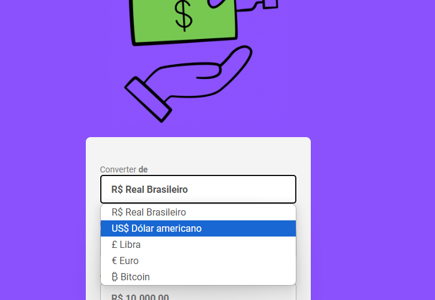

<h1>Conversor de Moedas</h1>
 

<h3>Conversor de moeda que atualiza nome, img e faz a formatação da moeda de acordo com a seleção desejada para a conversão de forma dinâmica</h3>
 
<H2>Tecnologias utilizadas:</H2>
 

*HTML

*CSS

*JAVASCRIPT

<b>Observação:</b>tentei por varias vezes refazer a lógica do conversor até conseguir chegar a essa versão teste6.js

